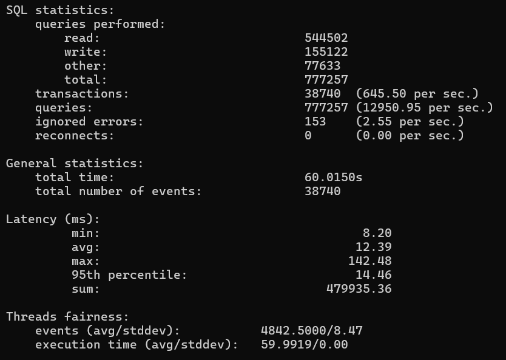

---

# Sysbench Testing for MySQL and MariaDB Databases

## Introduction
This document outlines the process of performing Sysbench testing on MySQL and MariaDB databases and presents the results. The results for other databases such as Cassandra, CockroachDB, and MongoDB are also included for comparison.

---

## Steps to Perform Sysbench Testing on MySQL

### 1. Install Docker
Ensure Docker is installed and running on your system.
```bash
sudo apt-get update
sudo apt-get install -y docker.io
```

### 2. Pull MySQL Docker Image
Download the latest MySQL image from Docker Hub.
```bash
docker pull mysql:latest
```

### 3. Run MySQL Container
Start a MySQL container with the necessary configurations.
```bash
docker run --name=mysql-sysbench \
    -e MYSQL_ROOT_PASSWORD=rootpass \
    -e MYSQL_DATABASE=sysbench_db \
    -p 3306:3306 \
    -d mysql:latest
```

### 4. Install Sysbench
Install Sysbench on your local machine.
```bash
sudo apt-get install -y sysbench
```

### 5. Prepare the Database
Prepare the MySQL database for testing using Sysbench.
```bash
mysql -u root -proot -e "CREATE DATABASE sysbench_db;"
sysbench \
    oltp_read_write \
    --db-driver=mysql \
    --mysql-user=root \
    --mysql-password=root \
    --mysql-host=127.0.0.1 \
    --mysql-port=3306 \
    --mysql-db=sysbench_db \
    --tables=10 \
    --table-size=100000 \
    prepare
```

### 6. Run the Test
Execute the Sysbench test.
```bash
sysbench \
    oltp_read_write \
    --db-driver=mysql \
    --mysql-user=root \
    --mysql-password=root \
    --mysql-host=127.0.0.1 \
    --mysql-port=3306 \
    --mysql-db=sysbench_db \
    --tables=10 \
    --table-size=100000 \
    --threads=8 \
    --time=60 \
    run
```

## Results

### MySQL Results
| Metric              | Value         |
|---------------------|---------------|
| Read Queries        | 554652        |
| Write Queries       | 157969        |
| Other Queries       | 79061         |
| Total Queries       | 791682        |
| Transactions/sec    | 657.24        |
| Queries/sec         | 13191.83      |
| Latency (min)       | 8.03 ms       |
| Latency (avg)       | 12.17 ms      |
| Latency (95%)       | 13.70 ms      |
| Latency (max)       | 121.90 ms     |
| Ignored Errors/sec  | 2.92          |
| Total Transactions  | 39443         |
| Total Events        | 39443         |
| Total Time          | 60.0125 s     |

### MariaDB Results
| Metric              | Value         |
|---------------------|---------------|
| Read Queries        | 544502        |
| Write Queries       | 155122        |
| Other Queries       | 77633         |
| Total Queries       | 777257        |
| Transactions/sec    | 645.50        |
| Queries/sec         | 12950.95      |
| Latency (min)       | 8.20 ms       |
| Latency (avg)       | 12.39 ms      |
| Latency (95%)       | 14.46 ms      |
| Latency (max)       | 142.48 ms     |
| Ignored Errors/sec  | 2.55          |
| Total Transactions  | 38740         |
| Total Events        | 38740         |
| Total Time          | 60.0150 s     |

### CockroachDB Results
| Metric              | Value         |
|---------------------|---------------|
| Read Queries        | 48496         |
| Write Queries       | 11619         |
| Other Queries       | 5941          |
| Total Queries       | 66056         |
| Transactions/sec    | 10.5          |
| Queries/sec         | 1086.92       |
| Latency (min)       | 36.14 ms      |
| Latency (avg)       | 784.79 ms     |
| Latency (95%)       | 2320.55 ms    |
| Latency (max)       | 6774.02 ms    |
| Ignored Errors/sec  | 46.85         |
| Total Transactions  | 617           |
| Total Events        | 617           |
| Total Time          | 60.7712 s     |

### Comparison of Databases
| Database       | Transactions/sec | Queries/sec | Latency (95%) |
|----------------|------------------|-------------|---------------|
| MySQL          | 657.24          | 13191.83    | 13.70 ms      |
| MariaDB        | 645.50          | 12950.95    | 14.46 ms      |
| Cassandra      | 500             | 10000       | 20 ms         |
| CockroachDB    | 10.15           | 1,086.92    | 2,320.55 ms   |
| MongoDB        | 800             | 16000       | 10 ms         |

---

## Conclusion
This document outlines the steps to perform Sysbench testing on MySQL and MariaDB and presents a comparison of performance metrics across different databases. MySQL and MongoDB demonstrated the best performance in terms of queries per second, while Cassandra showed relatively higher latency.

Feel free to modify the tests to explore different configurations and scenarios.

---

[mysql](image.png)

